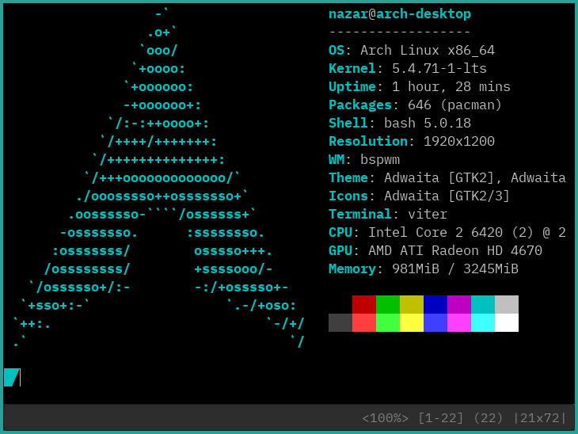

Viter is a terminal emulator written and expandable in Python.
It features Vim-like modes, key bindings, and status line and can act like a pager.

.. contents:: Navigation:
   :backlinks: none

============
Installation
============

~~~
AUR
~~~

Install the ``viter-git`` `AUR package`_.

~~~~~~~~~~~~~~~~~~~
Manual installation
~~~~~~~~~~~~~~~~~~~

Viter requires VTE and PyGObject. They are packaged as ``python-gobject`` and ``vte3`` on
Arch. Look for similarly named packages if you use another GNU/Linux distribution.

=====
Usage
=====

Run ``viter`` to launch the default shell in Viter. Run ``viter program [args]`` to launch
``program`` in Viter with ``[args]`` (may be empty). Substitute ``viter`` for
``/path/to/this/repo/viter.py`` if you didn't use AUR to install Viter.

Viter starts up in **NORMAL** mode where it behaves just like any other terminal emulator.
Press ``Ctrl+Shift+Space`` to switch to **DETACHED** mode and access most of the features
(see `Key bindings`_ and `Command interpreter`_). Press ``Escape`` to return to **NORMAL**
mode.

===========
Key bindings
===========

* Switching modes:

  * ``Escape``: switch to **NORMAL** mode
  * ``Ctrl+Shift+Space``: switch to **DETACHED** mode

* Navigating the scrollback

  * ``j``: one line down
  * ``k``: one line up
  * ``J``: half page down
  * ``K``: half page up
  * ``g``: to the beginning
  * ``G``: to the end

* Zooming

  * ``+``/``=``: make the font 25% larger
  * ``-``: make the font 25% smaller

* Search

  * ``/`` *pattern* ``Enter``: set the search pattern to *pattern*
  * ``n``: to the next occurrence of the search pattern
  * ``N``: to the previous occurrence of the search pattern

* Clipboard

  * ``c``: copy selected text
  * ``y`` *characters* ``Enter``:
    yank the first line that starts with *characters* (not counting whitespace)
  * ``v`` *characters* ``",`` *count* ``Enter``:
    yank the block of *count* lines, where the first line starts with *characters*
    (not counting whitespace)
  * ``V``: yank the whole window
  * ``Y``: yank the message in the bar
  * ``p``: paste
  * ``Ctrl+Shift+C``/``Ctrl+Shift+V``: copy/paste in **NORMAL** mode

* Command line

  * ``:`` *command* ``Enter``:
    execute *command* in the Python environment that executes the code of Viter
  * ``e`` *expression* ``Enter``: evaluate *expression* and print the result in the bar

===================
Command interpreter
===================

A status bar at the bottom of the window is shown when the user is in **DETACHED** mode.
It displays data in the format of
``<Zoom> [TopLineNum-BottomLineNum] (TotalLines) |TerminalHeightxTerminalWidth|`` while
being unfocused.

After the user typed some text into it and pressed ``Enter``, the entered text is
executed by Viter using ``exec`` (a Python built-in).

Use the ``win`` global variable to interact with the window. Some key bindings insert a
call to one of the methods of ``win``, for example:

* ``/`` inserts ``win.search("")`` and places the cursor between "".
* ``y`` inserts ``win.yank_line("")`` and places the cursor between "".
* ``e`` inserts ``win.echo()`` and places the cursor between ().

``win`` is an instance of the ``Window`` class that inherits ``Gtk.Window``.
Calls to the inherited methods are also valid, for example:

* ``win.set_title("Terminal")`` to set the title of the window to *Terminal*.
* ``win.close()`` to close the window.
* ``win.fullscreen()`` to make the window fullscreen.

``win`` has the ``term`` field of type ``Vte.Terminal``. See the Gtk documentation on
``Gtk.Window`` `[1]`_ and ``Vte.Terminal`` `[2]`_ for the full list of the methods and
fields. See the source of Viter to see the methods that are provided additionally to that
of ``Gtk.Window``.

==========
Pager mode
==========

If Viter is invoked as ``viter-pager``, Viter acts like a pager.  It starts up directly
into **DETACHED** mode. If there is no arguments, ``stdin`` is read, otherwise the
arguments are interpreted as file names.

Here are some examples of preprocessing the input:

* ``pygmentize | viter-pager`` — syntax highlighting.
* ``ul | viter-pager`` — converting overstriking to properly underlined text.

If you want to use Viter as your ``$MANPAGER``, make sure to cook the input via ``ul``.
The pages will lose formating (underlining, bold text) otherwise.

=============
Configuration
=============

Viter looks for the configuration file in the following order:

* ``$VITER_CONFIG``
* ``$XDG_CONFIG_HOME/viter/viterrc.py``
* ``$HOME/.config/viter/viterrc.py``

The first file that exists is read and then passed to ``exec`` just before Viter enters
the main loop. The file must be a valid Python script.

See an example of the configuration file here_.

.. LINKS
.. _AUR package: https://aur.archlinux.org/packages/viter-git/
.. _[1]: https://lazka.github.io/pgi-docs/Gtk-3.0/classes/Window.html
.. _[2]: https://lazka.github.io/pgi-docs/Vte-2.91/classes/Terminal.html
.. _here: https://github.com/Kharacternyk/dotfiles/blob/master/.config/viter/viterrc.py
.. _Kharacternyk: https://github.com/Kharacternyk
